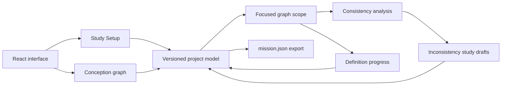

# Mission Dev

[](https://github.com/Raiagues/mission-dev/actions/workflows/ci.yml)
[](https://github.com/Raiagues/mission-dev/actions/workflows/pages.yml)

Mission Dev is an engineering-first web platform for conceiving satellite missions and progressively developing the software architecture that supports them. The product is designed around a shared mission model where assumptions, decisions, inconsistencies, studies and validation evidence remain connected and traceable as the project evolves.

Production

`https://raiagues.github.io/mission-dev/`

## Platform status

| Area | Status |
| --- | --- |
| Aerospace blueprint home | Available |
| Portuguese and English interface | Available |
| Create mission from scratch | Available |
| Study Setup before conception | Available |
| Interactive conception graph | Available |
| Card drag, canvas pan and zoom | Available |
| Top-to-bottom hierarchy organization | Available |
| Free Ideas and Open Questions work areas | Available |
| Focused graph pages | Available |
| Scope-specific inconsistencies | Available |
| Separate inconsistency study drafts | Available |
| Standard mission-definition progress | Available |
| Project-defined progress criteria | Available |
| Evidence-driven phase validation | Available |
| Local project persistence | Available |
| Project JSON export | Available |
| Desktop and mobile responsive interface | Available |
| Open existing project | In development |
| Import requirements | In development |
| Structured entry for an existing mission | In development |
| Persistent backend and authentication | Planned |

## Product principles

### Problem before solution

The early flow does not ask the user to choose antennas, payload hardware, CubeSat size or orbit before the mission need is understood.

### Embedded engineering intelligence

Assistance is part of the decision model rather than a separate chatbot. The platform surfaces gaps, tensions and implications from the project context and prevents a phase from being declared validated when mandatory evidence is missing.

### Shared context

Cards, connections, study configuration, progress rules, inconsistency studies and project references belong to one versioned project model. A focused page changes the working scope without discarding the macro mission context.

### Traceability

An inconsistency is explored in a separate study draft. Hypotheses, notes and the adopted conclusion remain stored without automatically polluting the macro mission graph.

### Tailorable definition

Mission Dev provides a baseline definition framework, but projects can configure their own progress criteria and attach those criteria to explicit evidence in the graph.

## Early mission flow

```text
Home
  ↓
Create project
  ↓
Build a mission from scratch
  ↓
Study Setup
  ↓
Conception Room
  ↓
Problem
  ↓
Context of use
  ↓
Objectives
  ↓
Mission concept
  ↓
Observation / Payload
  ↓
Platform
  ↓
Orbit and operations
  ↓
System and software
  ↓
Review
```

### Study Setup

The intermediate Study Setup page defines how the study should be interpreted before the brainstorming graph opens. It captures the study intent, starting statement, mission-definition framework and project references without forcing implementation decisions.

Supported study intents currently include problem-driven missions, technology demonstrations, science or exploration studies and open exploration.

The engineering rationale for this flow is documented in [`docs/UX_RESEARCH.md`](docs/UX_RESEARCH.md).

## Conception Room

The conception room is a spatial engineering workspace rather than a chat interface.

- Cards can be dragged directly.
- The canvas can be panned and zoomed without selecting text.
- Connections can be created from card handles and selected independently.
- The automatic layout organizes the main hierarchy from top to bottom.
- Cards can be moved into Free Ideas or Open Questions work areas.
- Any branch can be opened as a focused page and later returned to the macro view.
- Inconsistencies and progress are recalculated for the currently visible map.

## Inconsistency studies

Inconsistencies are not converted directly into new cards. Opening an inconsistency creates a separate study draft containing

- the project evidence involved
- candidate hypotheses
- study notes and trade-offs
- favored and rejected alternatives
- an explicit adopted conclusion

The main map is changed only through deliberate project decisions. A resolved study is stored in the project history and can be reopened.

## Mission progress

Mission Dev supports two progress models.

### Standard

The standard model derives progress from early mission evidence such as the core problem, desired result, context, beneficiary, time priority and major constraints.

### Custom

A project can define its own criteria. Custom criteria are connected to evidence cards instead of being manually checked off. Their state is derived from the state of the linked evidence.

A phase cannot be validated merely by pressing a button. Mandatory criteria must have defined evidence and critical inconsistencies must be resolved.

## Project model and export

The current prototype persists the complete project in the browser as a versioned JSON model. The UI exposes the internal structure as virtual project files.

```text
/project.json
/config/study.json
/config/progress.json
/boards/problem.json
/studies/inconsistencies.json
/templates/active.json
```

The project can be exported as a `.mission.json` file containing the study configuration, mission graph, progress model, inconsistency studies and template metadata.

This structure is intentionally backend-ready. A future persistence layer can map the same objects to project storage without redesigning the product model.

## Templates and standards

The project model already separates template configuration from user-editable project content. This is intended to support future organization or regulatory templates where some phases, criteria or configuration paths are prescribed while selected fields remain editable.

The architecture is compatible with project-specific tailoring rather than assuming one universal process for every CubeSat or mission class.

## Architecture

Mission Dev is a client-side React application built with TypeScript and Vite.



### Main source areas

```text
src/
├── components/
│   ├── Brand.tsx
│   ├── IssueStudyPanel.tsx
│   ├── LanguageToggle.tsx
│   └── UserBadge.tsx
├── lib/
│   ├── i18n.ts
│   ├── missionModel.ts
│   ├── projectStore.ts
│   ├── types.ts
│   └── uxCopy.ts
├── pages/
│   ├── HomePage.tsx
│   ├── StudySetupPage.tsx
│   └── BrainstormPage.tsx
├── App.tsx
├── main.tsx
├── styles.css
└── workspace.css
```

`missionModel.ts` contains deterministic graph, progress and consistency logic. `projectStore.ts` defines the versioned persistent project format, project seeding, virtual files and export. UI pages consume these models instead of embedding project state inside visual components.

## Technology stack

- Node.js 22
- React 19
- TypeScript 5
- Vite 7
- Vitest
- ESLint
- GitHub Actions
- GitHub Pages

## Quality gates

Every pull request targeting `main` runs

```text
TypeScript typecheck
ESLint with zero warnings
Vitest unit tests
Vite production build
```

The production deployment repeats the full quality gate before generating the GitHub Pages artifact. After deploy, the workflow verifies the live page and its production JavaScript and CSS assets before publishing the deployment status as successful.

## Local development

Requirements are Node.js 22 or newer and npm.

```bash
npm ci
npm run dev
```

Run the complete quality gate with

```bash
npm run quality
```

Individual commands

```bash
npm run typecheck
npm run lint
npm run test
npm run build
```

## CI and CD

`.github/workflows/ci.yml` runs quality checks on pull requests and changes to `main`.

`.github/workflows/pages.yml` creates the production build and deploys `dist` to GitHub Pages only after the quality gate passes. The live deployment is then checked before the workflow is considered successful.

## Roadmap

- backend project storage and authenticated workspaces
- import and reopen `.mission.json` projects
- project templates with locked and editable paths
- ECSS and organization-specific applicability profiles
- structured import of requirements and reference documents
- deeper context and objective stages
- mission-level trade studies and decision records
- progressive CubeSat configuration only after mission needs justify platform decisions
- generated technical satellite drawings driven by project configuration
- requirements traceability into mission software architecture
- team collaboration and role-based project access
