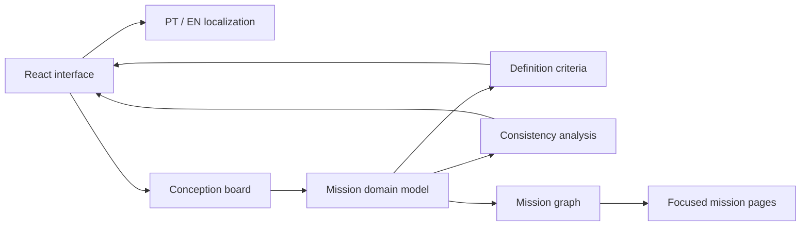

# Mission Dev

[](https://github.com/Raiagues/mission-dev/actions/workflows/ci.yml)
[](https://github.com/Raiagues/mission-dev/actions/workflows/pages.yml)

Mission Dev is a web platform for the conception and progressive development of satellite mission software. The product is being designed around an engineering-first workflow where mission decisions remain traceable, connected and technically coherent as the project evolves.

The current prototype focuses on the earliest stage of a mission. Instead of forcing the user to define hardware or orbital choices before the problem is understood, the platform begins with a conception board that allows ideas, hypotheses, open questions, constraints and inconsistencies to be explored as a connected engineering model.

## Platform status

| Area | Status |
| --- | --- |
| Home and project entry | Available |
| Portuguese and English interface | Available |
| Create mission from scratch | Available |
| Interactive conception board | Available |
| Hypotheses and open questions | Available |
| Manual and automatic graph organization | Available |
| Connection creation and removal | Available |
| Inconsistency detection | Available |
| Resolution hypotheses based on project context | Available |
| Mission definition progress | Available |
| Validation rules for the Problem phase | Available |
| Focused sub-pages for a branch of the mission | Available |
| Desktop and mobile responsive interface | Available |
| Open existing project | In development |
| Import requirements | In development |
| Structured entry for an existing mission | In development |
| Documentation module | In development |
| Persistent backend and authentication | Planned |

## Product principles

- Problem before solution. The platform does not ask for antennas, payload configuration or CubeSat form factor while the mission is still being conceived.
- Embedded engineering intelligence. Assistance is part of the decision system rather than a separate chat window.
- Context is shared. Every node and connection contributes to the project context used to detect conflicts and propose hypotheses.
- Decisions remain traceable. The user can see how ideas are connected, where assumptions exist and why a phase is not yet considered defined.
- Progress is informative rather than restrictive. Users can continue exploring before a phase is closed, but a phase cannot be declared validated until its mandatory engineering criteria are satisfied.
- Technical visual language. The interface uses an aerospace blueprint aesthetic with restrained technical drawing elements instead of a generic consumer application design.

## Architecture

The application is a client-side React application built with Vite. Mission-domain logic is kept separate from presentation so the conception model can later move behind an API without rewriting the interface.



`src/pages` contains the main product screens. `src/lib/missionModel.ts` contains deterministic engineering logic such as inconsistency detection, progress calculation, mandatory phase validation and focused graph traversal. `src/lib/i18n.ts` contains the Portuguese and English product vocabulary. `src/components` contains reusable interface elements. `tests` validates the mission model independently from the UI.

## Technology stack

- Node.js 22
- React 19
- TypeScript
- Vite
- Vitest
- ESLint
- GitHub Actions
- GitHub Pages

## Quality gates

Every pull request and update to `main` runs the CI workflow. A change is accepted only after these checks pass.

```text
TypeScript typecheck
ESLint
Vitest unit tests
Vite production build
```

The deployment workflow repeats the complete quality gate before producing the GitHub Pages artifact. The deploy job only starts after the production build succeeds.

## CI and CD

`.github/workflows/ci.yml` runs on pull requests and pushes to `main` and validates types, lint rules, unit tests and the production build.

`.github/workflows/pages.yml` runs on `main`, repeats the quality gate, packages only the `dist` directory and deploys the result to the `github-pages` environment.

The Vite base path is `/mission-dev/` so JavaScript, CSS and application assets resolve correctly from the repository GitHub Pages URL.

## Local development

Requirements are Node.js 22 or newer and npm.

```bash
npm install
npm run dev
```

Run the complete quality gate with

```bash
npm run quality
```

Individual checks are also available through `npm run typecheck`, `npm run lint`, `npm run test` and `npm run build`.

## Repository structure

```text
mission-dev/
├── .github/
│   └── workflows/
│       ├── ci.yml
│       └── pages.yml
├── src/
│   ├── components/
│   ├── lib/
│   ├── pages/
│   ├── App.tsx
│   ├── main.tsx
│   └── styles.css
├── tests/
│   └── missionModel.test.ts
├── eslint.config.js
├── index.html
├── package.json
├── tsconfig.app.json
├── tsconfig.json
├── tsconfig.node.json
└── vite.config.ts
```

## Current conception workflow

1. Starting point
2. Problem
3. Use context
4. Objectives
5. Mission concept
6. Observation and payload
7. Platform
8. Orbit and operations
9. System and software
10. Review

Only the Starting Point and Problem experience is currently implemented in depth. Later stages remain visible in the hierarchy so users understand where their current work fits within the complete mission development process.

## Interface language

The platform supports Portuguese and English. The selected language is stored in the browser and shared across screens. All current platform-controlled content has a translation in both languages. Free-form user content remains exactly as entered.

## Design system

The visual identity is based on aerospace engineering drawings rather than conventional consumer-product UI.

- Dark navy technical grid
- Thin blueprint construction lines
- Restrained blue and white technical accents
- Orthographic satellite technical drawings
- Minimal shadows and decoration
- Compact engineering typography
- Visible hierarchy and traceability
- Responsive layouts for desktop and mobile

The home screen cycles between two technical orthographic satellite views implemented as vector engineering drawings. Future projects are intended to replace these generic views with drawings generated from the satellite configuration being developed by the user.

## Roadmap

- Persist conception boards and project history
- Add the structured entry path for users who already have a mission definition
- Implement use-context and objective stages
- Expand consistency rules across mission stages
- Introduce CubeSat configuration only after mission requirements justify platform decisions
- Generate progressive technical drawings from the evolving mission architecture
- Add requirements traceability
- Introduce mission software architecture and subsystem views
- Add team collaboration and role-based project access

## Deployment

Production is deployed through GitHub Actions to GitHub Pages from the `main` branch.

`https://raiagues.github.io/mission-dev/`
